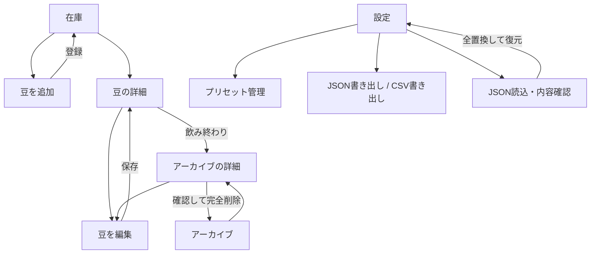

# Coffee Cellar 初期版設計

作成日：2026-09-17  
状態：実装の基準となる設計。段階3の実装・Chrome検証済み。iPhone実機は未検証。進捗はROADMAP.mdを参照。
関連：[ロードマップ](ROADMAP.md) / 元仕様：`coffee_cellar_codex_handoff.md`

## 変更仕様：豆別まとめとプリセット連動（2026-09-17）

今回のユーザー指定により、以下は当初仕様を置き換える。

- 初期表示は「豆別まとめ」。プリセット手動順のグループに同名の袋をまとめ、袋は古い順。「古い順」「新しい順」にも切替可能。
- グループ内は1袋1行（高さ31px）。開封列は開封日（YY/M/D）・不明・未開封を示し、未開封は淡色にする。列幅は最長表示（1年11ヶ月・中深煎り・26/12/20）に合わせて固定し、余りは列間に等分する。焙煎度・焙煎日・開封は中央揃え。焙煎度は数値のみ、日付はYY/M/D。経過は1ヶ月未満が日数、1年未満が0.1ヶ月単位（切り捨て）、1年以上が「N年Mヶ月」。
- プリセットの名前タップで編集・削除を展開。≡をPointer Eventsで直接追従させて並べ替える。端で自動スクロール、キャンセルで元へ戻し、キーボード↑↓も対応。
- DB v4：beanに`presetId: UUID | null`、presetに`order: 非負整数`を追加。既存名の完全一致と既知の旧メニュー名で移行し、推測で結び付けない。
- プリセット名変更は紐付いた豆（在庫・履歴）にも同一トランザクションで反映。削除時は名前を残し、紐付けだけ解除。手動の別名への豆編集も解除する。
- JSON形式v2で順序・紐付けを往復保存。v1は取込時に移行。参照先不明・名前不一致・順序重複は拒否する。
- 新規プリセットは末尾へ追加。未登録の豆グループはプリセットの後ろに並べる。同名の自由入力豆も1カードにまとめる。

以下の初期設計と異なる場合はこの変更仕様を優先する。

## 1. 設計上の決定

個人のセラー在庫を「古いものから見つけ、飲み終わったら履歴に移す」ことを中心にする。ロードマップの推奨初期案を採用し、以下を初期版の実装基準とする。

| 項目 | 決定 |
| --- | --- |
| 登録の単位 | 1レコード＝1袋。同名・同じ焙煎日の複数登録を許可する。 |
| 技術 | HTML / CSS / Vanilla JSのES Modules。アプリ配信にビルドと外部CDNは不要。 |
| 永続化 | IndexedDB。メモリだけの代替保存を成功扱いしない。 |
| 配信 | GitHub Pages。リポジトリ配下のサブパスに対応する。 |
| 画面遷移 | ハッシュルーティング。URLの`#`以降で画面を指定する。 |
| UI | 日本語、iPhone優先、3つの下部タブ。フォームは独立したページ。 |
| 日付 | 焙煎日は日付のみ、登録・飲み終わりは時刻付き。表示の「今日」は端末の現地日付。 |
| 復元 | JSONの全置換。全件検証と利用者の確認後、単一トランザクションで反映。 |
| 追加候補 | 新しい順・豆名順の並べ替え。在庫へ戻す機能は初期版必須に含めない。 |

数量・残量、ログイン、クラウド同期、写真、通知などはロードマップどおり対象外。デザイン上の追加判断は本書で明示し、元仕様にあった要件とは区別する。

## 2. 画面遷移



在庫・アーカイブ・設定の間は下部タブで移動する。詳細画面では所属するタブを選択状態にする。フォーム・復元確認中はタブを隠し、戻る操作と主操作に集中させる。

| URL | 画面 | 終了後・戻る先 |
| --- | --- | --- |
| `#/inventory` | 在庫 | 初回起動・不明なルートの移動先 |
| `#/beans/new` | 追加 | 登録後は在庫。条件で隠れる場合はフィルターを「すべて」に戻す。 |
| `#/beans/:id` | 詳細 | 状態に応じて在庫またはアーカイブ |
| `#/beans/:id/edit` | 編集 | 同じ豆の詳細 |
| `#/archive` | アーカイブ | 下部タブ |
| `#/settings` | 設定 | 下部タブ |
| `#/settings/presets` | プリセット管理 | 設定 |
| `#/settings/restore` | 復元確認 | 設定。読み込んだデータがない場合も設定へ戻す。 |

ブラウザの戻る操作を尊重し、直接詳細URLを開いた場合にもアプリ内の戻る先を用意する。存在しないIDは「この豆は見つかりません」と一覧へのリンクを表示する。未保存変更があるフォームをアプリ内で離れる際は破棄確認を出す。OSによる終了後の入力復元は初期版では保証しない。

## 3. 画面の情報設計

### 在庫

```text
Coffee Cellar
現在の貯蔵数                     12袋

[全期間] [1ヶ月以上] [半年以上]  [豆別 ▾]

エチオピア Guji                     ›
1年4ヶ月
焙煎度 2 / 5  ·  焙煎日 2025/05/12
──────────────────────────────────
ケニア Nyeri                        ›
8.3ヶ月
中深煎り      ·  焙煎日 …

                     [＋ 豆を追加]
──────────────────────────────────
    在庫       アーカイブ       設定
```

- 袋数は在庫全体。絞り込み中は「該当 3 / 12袋 · 1ヶ月以上」と対象数も表示する。
- 上部は識別のための最小限にとどめ、一覧の見出し行（COLLECTION / ARCHIVE）は置かない。
- 初期順は必ず焙煎日の昇順。同日は登録日時の昇順、最後にIDで安定させる。
- フィルターとスクロール位置は画面を往復する間だけ保持する。再読み込み時は「すべて・古い順」に戻る。
- 期間が長い豆にも期限切れを意味する赤色や危険マークは付けない。熟成期間の表示で見つけやすくする。
- 空なら「まだ豆がありません」と追加ボタン。フィルターで0件なら「この期間の豆はありません」と条件解除を表示する。

### 追加・編集

```text
‹ 戻る                    豆を追加

豆名
[プリセットから選ぶ              ▾]
[エチオピア Guji                   ]
プリセットを選んだ後も編集できます

焙煎度
[1] [2] [3] [4] [5] [その他]
（その他を選んだときだけ入力欄）

焙煎日
[2026 / 09 / 17                    ]

[               登録              ]
```

- 豆名入力欄を唯一の保存元とする。プリセット選択はこの欄へ名前をコピーする操作であり、2つの入力の優先順位問題を作らない。
- プリセットが空なら選択欄の代わりに「設定でプリセットを追加できます」を表示する。自由入力は常に使える。
- 追加時は豆名・焙煎度を未選択、焙煎日を今日にする。焙煎度を暗黙に決めない。
- 編集時は保存値を表示し、主ボタンを「保存」にする。登録日時や飲み終わり日時は変更しない。

### 開封日

詳細画面の操作は上段に「編集」「開封」、下段に「飲み終わり」を置く。375px幅で3つ横並びにすると文字が折り返すため段を分ける。開封ボタンはダイアログを開き、日付入力（初期値は今日、`min`は焙煎日、`max`は今日）、「保存」「日付不明」「未開封に戻す」「キャンセル」を出す。未開封の豆では「未開封に戻す」を隠す。アーカイブ済みの豆には開封ボタンを出さない。

入力欄の`min`/`max`でブラウザが先に弾くが、保存時も`validateOpened`で焙煎日より前・未来・不正な日付を拒否する。復元時は焙煎日と同じく未来日を許容する。
- 「その他」から数字へ切り替えたとき、入力途中の文字は画面内では保持してよいが、DBには選択された方式だけを保存する。
- 入力エラーは該当欄の近くに表示し、送信時は最初のエラーへフォーカスする。
- 保存中は二重送信を防ぎ「保存中…」を表示する。成功後に遷移し、失敗時は入力内容を保持して再試行できるようにする。

### 詳細・アーカイブ

詳細は豆名、焙煎度、焙煎日、現在までの経過年月・日数、登録日時を表示する。在庫には「編集」「飲み終わり」を表示し、完全削除は置かない。

飲み終わり操作の保存後は同じ豆のアーカイブ詳細へ切り替え、「飲み終わった豆に移しました」と表示する。初期版では確認ダイアログを挟まず、データは履歴に残す。在庫へ戻す機能は今後の候補とする。

アーカイブ一覧は飲み終わり日時の降順。同時刻はIDで安定させる。詳細には飲み終わり日時、編集、完全削除を表示する。完全削除は「『豆名』を完全に削除しますか？ この操作は取り消せません。」と確認し、初期フォーカスをキャンセルに置く。

アーカイブで経過期間を表示する場合は「焙煎から現在まで」と明記し、飲み終わり時点の期間と混同させない。

### 設定・プリセット

設定は「豆プリセット」「バックアップと復元」「アプリについて」のグループで構成する。保存先の説明は「データはこの端末のブラウザ内に保存されます。別の端末へ移すときはJSONバックアップを使ってください。」とする。

プリセットは名前順に表示し、追加・編集・削除を行う。前後空白を除いた同一文字列の重複は防ぐが、大文字小文字や全角半角を勝手に統一しない。削除時は対象名を含めた確認を出す。登録済みの豆への影響はない。

設定からJSONとCSVを書き出す。復元では現在とファイル内それぞれの「在庫・アーカイブ・プリセット」の件数、ファイル作成日時、全置換されることを表示する。「現在のデータを書き出す」「キャンセル」「全データを置き換えて復元」を用意する。

## 4. 見た目と操作感

以下は今回のデザイン初期案。色・余白は画面実装後に実機で調整する。

| 要素 | 初期値・方針 |
| --- | --- |
| 背景 / 一覧面 | 温かい白 `#F6F3EE` / 白 `#FFFFFF` |
| 主文字 / 補助文字 | `#29251F` / `#655E55` |
| 主操作 | コーヒーを連想する茶 `#6B4935`、白文字 |
| 破壊的操作 | `#A12F2F`。完全削除などに限定する。 |
| 書体 | `system-ui`を優先。本文は1rem以上、行高1.5程度。 |
| タップ領域 | 原則44×44 CSS px以上、主ボタンは高さ48px以上。 |
| 余白 | 4・8・12・16・24・32pxを基本にremへ換算する。 |
| 一覧 | 一列。長い豆名を折り返し、経過期間を読み取りやすくする。 |
| 下部タブ | アイコンと文字を併記。選択状態を色だけに頼らず示す。 |
| 動き | 押した瞬間に状態を返す。画面遷移は静的または短いフェード。操作を待たせる演出を入れない。 |

下部タブは軽い半透明の面とし、非対応・透明度低減時は不透明にする。独自のスワイプ操作やドラッグ式シートは初期版に導入しない。`prefers-reduced-motion`では動きを抑える。

`viewport-fit=cover`とsafe areaを考慮し、一覧末尾がタブと追加ボタンの下に隠れない余白を確保する。フォームの保存ボタンは本文の末尾に置き、キーボードと重なる固定配置を避ける。狭い画面や文字拡大では焙煎度ボタンとフィルターを折り返す。

ネイティブのbutton・input・select・radioを優先し、ラベル、キーボード操作、フォーカス表示、画面遷移時の見出しへのフォーカス、完了通知の読み上げに対応する。本文の色は4.5:1以上を目標に検証する。初期の色構成はライトのみとし、ダークテーマは追加候補に置く。

## 5. データ契約

### IndexedDB

DB名は `coffee-cellar`、現行バージョンは `3`（v2で写真のメニュー9種類を追加、v3で標準名の国等と地区等の間を「｜」に変更）。このDB名は同一オリジンで一つの本アプリを運用する前提で固定する。別テスト環境は別オリジンか別DB名を使い、本番データに接続しない。

| ストア | 主キー | インデックス |
| --- | --- | --- |
| `beans` | `id` | `status`、`[status, roastDate]` |
| `presets` | `id` | `name`（unique） |

| 豆のフィールド | 型・制約 |
| --- | --- |
| `id` | UUID文字列。作成後に変更しない。 |
| `name` | 前後空白を除いた空でない文字列。 |
| `roastType` | `scale` または `custom` |
| `roastValue` | scaleなら整数1〜5、customならnull |
| `roastCustom` | customなら空白だけでない文字列、scaleならnull |
| `roastDate` | 実在する`YYYY-MM-DD`。新規・編集では今日以前。 |
| `createdAt` | UTCのISO 8601日時文字列。新規登録時に自動設定。 |
| `status` | `active` または `archived` |
| `finishedAt` | activeならnull、archivedならISO 8601日時文字列 |
| `openedDate` | 未開封はnull、日付不明は`unknown`、それ以外は実在する`YYYY-MM-DD`。焙煎日以降かつ今日以前。 |

プリセットは `id` と `name` のみ。豆はプリセットIDを参照せず、その時点の名前を保持する。表示用の日数・年月は保存しない。

日時は書き出し時もUTC表記に統一し、画面では端末の現地日時で表示する。復元ではタイムゾーン付き日時を受け付け、同じ瞬間のUTC表記に正規化する。登録・飲み終わりの順序は端末時計の変更もありうるため、それだけでは復元を拒否しない。

### 保存と状態変更

| 操作 | 保存する変更 |
| --- | --- |
| 新規 | UUIDを生成し、`active`、`finishedAt: null`、登録日時を設定 |
| 編集 | 名前・焙煎度・焙煎日のみ更新。ID・登録日時・状態・飲み終わり日時・開封日を保持 |
| 開封 | 詳細画面の専用ダイアログで`openedDate`だけを更新。追加・編集フォームでは扱わない |
| 飲み終わり | activeをarchivedにし、飲み終わり日時を設定 |
| 完全削除 | archivedだけを削除。activeへの削除要求は拒否 |

保存結果は個別リクエストの成功ではなくトランザクション完了を待って画面に反映する。復元のclearと再投入も一つのトランザクションにまとめる。これはIndexedDBの処理モデルに沿う。[MDN: Using IndexedDB](https://developer.mozilla.org/en-US/docs/Web/API/IndexedDB_API/Using_IndexedDB)

書込み時は対象を同じトランザクション内で再取得する。削除済みレコードを編集で復活させず、飲み終わりの二重操作で日時を上書きしない。アプリ内の保存は直列化する。別画面から復帰した際にはDBを再読込する。同じ項目の複数ウィンドウ同時編集は最後の確定値を採用し、リアルタイム共同編集は扱わない。

DB移行では既存ストアを安易に削除しない。`versionchange`で接続を閉じ、更新が他ウィンドウに阻まれた場合は閉じるよう案内する。読込失敗を「0袋」として表示せず、再試行できるエラー画面にする。

## 6. 日付計算

日数と年月の計算を `dates.js` の純粋関数にまとめ、現在日付を引数で渡せるようにする。

1. `YYYY-MM-DD`を年・月・日に分解し、実在する日付かを確認する。年は0001〜9999の4桁とする。
2. 「今日」は端末のローカル年月日から得る。UTC文字列の先頭10文字を今日として使わない。
3. 両日付をUTC午前0時相当の暦日番号へ変換し、その差を日数とする。年0〜99のDateコンストラクタの特殊扱いを避け、明示的な年設定か暦日アルゴリズムを使う。
4. 年月は満了した月数で計算する。開始日にNか月を加え、存在しない日はその月末へ丸めた「記念日」が今日以前になる最大のNを採る。
5. 月数0は「N日」。12未満は満了月数に「記念日からの日数 ÷ 次の記念日までの日数」を足し、0.1ヶ月単位で切り捨てて「7.5ヶ月」とする（ちょうどでも「6.0ヶ月」）。12以上は「N年Mヶ月」で余り0ヶ月は省略する。総日数は詳細画面にのみ併記し、1ヶ月未満は表示と重複するため省く。

| 焙煎日 → 今日 | 日数 | 年月表示 |
| --- | --- | --- |
| 2026-09-17 → 2026-09-17 | 0 | 0日 |
| 2026-08-18 → 2026-09-17 | 30 | 30日 |
| 2026-01-31 → 2026-02-28 | 28 | 1.0ヶ月 |
| 2026-01-31 → 2026-03-30 | 58 | 1.9ヶ月 |
| 2026-03-18 → 2026-09-17 | 183 | 5.9ヶ月 |
| 2024-02-29 → 2025-02-28 | 365 | 1年 |
| 2025-05-12 → 2026-09-17 | 493 | 1年4ヶ月 |

「1ヶ月以上 / 半年以上」は、表示と同じ満了月数（`elapsedMonths`）が1 / 6以上の豆。表示が「5.9ヶ月」の豆は半年以上に含まれない。表示文字列ではなく数値で判定する。

起動時、`pageshow`、画面が可視に戻った時に再計算する。起動中は次の現地午前0時で更新を予約し、復帰時には予約し直す。端末時計を戻したため保存済み焙煎日が未来になった場合は「焙煎日を確認」と表示し、期間フィルターから除外する。データを自動修正しない。

## 7. バックアップと復元

### JSON形式 v1（現行はv3。v3は各豆に`presetId`と`openedDate`、各プリセットに`order`を加える）

```json
{
  "schemaVersion": 1,
  "exportedAt": "2026-09-17T03:00:00.000Z",
  "beans": [
    {
      "id": "a8f5fd6c-8024-4d67-a0ed-cd9e6c604c41",
      "name": "エチオピア Guji",
      "roastType": "scale",
      "roastValue": 2,
      "roastCustom": null,
      "roastDate": "2025-05-12",
      "createdAt": "2025-05-18T01:23:00.000Z",
      "status": "active",
      "finishedAt": null
    }
  ],
  "presets": []
}
```

ファイル名は端末の当日を使い `coffee-cellar-backup-YYYY-MM-DD.json` とする。全ストアを一つの読取トランザクションで取得し、在庫と履歴の一貫したスナップショットを作る。生成後はユーザー操作からファイル保存へ進む。保存先への書込み完了をアプリから確認できない場合は「バックアップ済み」と断定しない。

復元はファイル拡張子だけを信用せず、次を検証する。

- ルートのオブジェクト、対応する`schemaVersion`、日時、配列、全必須フィールド。
- UUID、同一ストア内のID重複、プリセット名重複、名前と焙煎度の値、実在する焙煎日、状態とnullの整合。
- v1で定義しないフィールドは、情報を黙って捨てないためエラーとする。将来の形式は移行処理を追加してから受け付ける。
- 復元は保存データの再現を優先し、現地日付の違いや時計変更で未来になった焙煎日は拒否せず件数を確認画面で知らせる。新規・編集の未来日禁止とは分ける。

ファイル解析・検証・利用者確認はDBトランザクション開始前に済ませる。復元時は`beans`と`presets`を含む単一readwriteトランザクションで全消去と挿入を行う。途中失敗は全体をロールバックし、現在データを保持する。成功後は画面のキャッシュ・フィルター・編集中データをリセットする。空の配列も有効なバックアップだが、全件消えることを明示して確認する。

### CSV

列順は `name,roast,roastDate,openedDate,ageDays,status,finishedAt`。`openedDate`は未開封が空欄、日付不明が`unknown`。在庫とアーカイブを両方含め、焙煎日・登録日時・IDの順で並べる。焙煎度は数字なら `2 / 5`、自由入力ならその文字列を使う。`ageDays`は書き出した現地日付まで、`finishedAt`はUTC日時または空欄。

UTF-8 BOM付き、CRLF改行、文字列フィールドを二重引用符で囲み内部の引用符を二重化する。自由入力が先頭空白・制御文字を除くと `=`, `+`, `-`, `@` で始まる場合や、先頭にタブ・改行を持つ場合は先頭にアポストロフィを付け、表計算ソフトでの式評価を避ける。CSVは閲覧用で、元の値を完全に保つ復元にはJSONを使う。

## 8. PWA・公開・更新

GitHub Pagesのプロジェクトサイトは通常リポジトリ名を含むパスになるため、配信基点を固定の`/`にしない。[GitHub Pages公式資料](https://docs.github.com/en/pages/getting-started-with-github-pages/what-is-github-pages)

- HTMLのアセットは`./`、ES Modulesは各モジュールからの相対URLを使う。
- manifestは`name: Coffee Cellar`、`short_name: Coffee`、`start_url: ./`、`scope: ./`、`id: ./`、`display: standalone`を基本にする。
- PNGアイコン192px・512px、maskable用アイコン、iPhone用apple-touch-iconを同梱する。
- Service Workerは配信基点直下に置き、`./service-worker.js`を`./`スコープで登録する。
- キャッシュ名にはアプリ名・配信スコープ識別子・リリース番号を含める。同一オリジンの別アプリのキャッシュを削除しない。
- 必須HTML・CSS・JS・manifest・アイコンをインストール時にまとめてキャッシュする。必須ファイル取得に失敗した新版は有効化せず、旧版を残す。
- 制御下の画面と同梱アセットはリリース単位のキャッシュ優先。ナビゲーションはキャッシュしたindex.htmlへ解決し、ネットワーク上の新旧ファイルを混在させない。
- 外部URL、対象外のリクエスト、利用者が書き出すファイルはキャッシュしない。ローカル起動もHTTPのlocalhostで行う。

Service Workerの新版は待機状態を経るため、更新可能になったら「新しいバージョンがあります」と更新ボタンを出す。[MDN: Using Service Workers](https://developer.mozilla.org/en-US/docs/Web/API/Service_Worker_API/Using_Service_Workers)

更新は未保存フォームやDB書込みがない状態で利用者が選んだときに適用する。初期版は全ウィンドウを閉じて開き直す手順を基本とし、無条件の`skipWaiting()`で他の画面まで切り替えない。将来即時更新を入れる場合は全クライアントの未保存状態を調整する。新版activate時に自アプリの古いキャッシュを掃除し、IndexedDBは維持する。

初回のキャッシュ完了・有効化を確認してから設定に「オフライン利用の準備ができました」と表示する。初回アクセスそのもののオフライン動作は対象外。

ブラウザの保存領域は削除される場合があり、永久保存とは扱わない。設定にJSONバックアップの導線を常設する。[WebKit: Updates to Storage Policy](https://webkit.org/blog/14403/updates-to-storage-policy/)

Safariとホーム画面アプリの保存領域の共有は前提にせず、実機で確認する。使う起動方法を切り替えてデータが見えない場合はJSONで移す。公開オリジンを変える場合も移行が必要になるため、公開URLは実データ投入前に決める。

## 9. ファイルと責務

| ファイル | 責務 |
| --- | --- |
| `index.html` | アプリの骨格、viewport、manifestとアイコン参照 |
| `style.css` | レイアウト、色、文字、safe area、アクセシビリティ |
| `app.js` | 起動、ルート、画面状態、イベント、PWA状態の表示 |
| `db.js` | DB接続、移行、CRUD、スナップショット、全置換 |
| `dates.js` | 日付の検証、日数、年月、当日判定 |
| `validation.js` | 豆・プリセット・バックアップの検証。DOMとDBに依存しない。 |
| `backup.js` | JSON解析・生成、CSV生成、ファイル受渡し |
| `manifest.webmanifest` / `service-worker.js` | PWA定義 / キャッシュとライフサイクル |
| `icons/` / `tests/` | 同梱アイコン / 日付・保存・復元などの検証 |
| `README.md` | 起動、公開、利用、データ移行の手順 |

依存は `app → db / dates / validation / backup` とし、`backup → validation / dates` を許容する。JSON・CSVの生成はデータを受け取る関数とし、DBの読取りや復元実行はappから調整する。利用者の文字列はHTMLとして挿入せずテキストとして描画する。

## 10. 実装と受入れの順序

| 順序 | 作るもの | 合格条件 |
| --- | --- | --- |
| 1 | 日付・検証関数、IndexedDB | 本書の日付例、必須項目、保存・再読込、保存失敗が確認できる。 |
| 2 | 在庫・追加・詳細・編集 | 同じ豆を2袋登録でき、古い順に並び、編集後もID・登録日時が保たれる。 |
| 3 | 飲み終わり・履歴・完全削除 | 履歴へ移動し、再起動しても残る。削除キャンセルと確定が正しく動く。 |
| 4 | プリセット・期間フィルター | 名前変更が登録済みの豆に影響しない。満了1ヶ月・6ヶ月の前日と当日、月末日の境界が正しい。 |
| 5 | JSON書き出し・復元 | 全項目の往復一致、不正入力拒否、失敗時の全体ロールバック、空データ復元を確認。 |
| 6 | CSV・PWA・UI仕上げ | 特殊文字CSV、オフラインの主要操作、更新後のDB保持、サブパス配信を確認。 |
| 7 | 公開準備・iPhone実機 | Safariとホーム画面起動、safe area、文字拡大、日付入力、ファイル保存と復元を確認。 |

自動テストは日付・入力・復元・DB操作に重点を置く。保存失敗、DB接続失敗、別ウィンドウによるDB更新待ち、新版キャッシュ取得失敗も確認する。元仕様第23章の20条件を最終チェックリストに転記して検証し、実機未確認を自動テスト成功で代替しない。

Git初期化、段階1の実装ファイル、READMEとテスト環境の準備は完了した。プリセット管理・期間フィルター・JSONバックアップと復元も実装済み。CSVとPWA・オフライン対応も実装済み。GitHubアカウント・公開リポジトリと検証用iPhoneのOSバージョンは公開・実機検証前に確認する。
